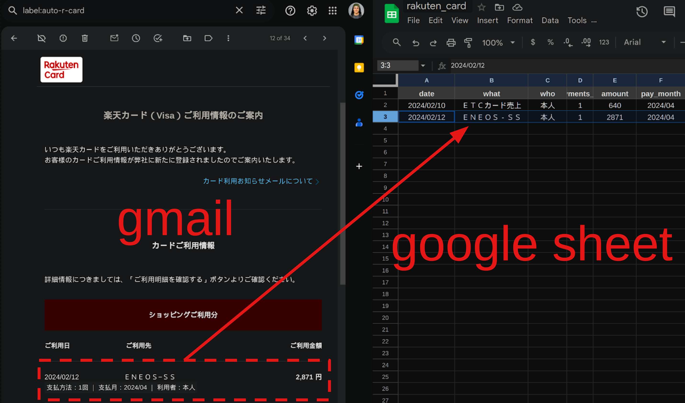

# gmail-to-sheet


App Script to automatically extract info from Gmail and add them to Google Sheet.




Supported email senders:

- Rakuten credit card
- Rakuten mobile
- Setagayapay (setapay)


## How to use:

- Create a Google Spreadsheet
- Copy Code.gs into AppScript
- Setup a daily tigger
- Setup two Gmail filters for every email sender (one filter for every label) to automatically label emails auto/to-process auto/EMAIL-SENDER

### rakuten card

Create two filters with same search:
 ```
 from:(info@mail.rakuten-card.co.jp) subject:(カード利用のお知らせ(本人ご利用分) -【速報版】)
 ```
one with apply label: auto/r-card, another with apply label: auto/to-process

### setapay 
 
Create two filters with same search:
 ```
 from:(setagayapay@mail.moneyeasy.jp) (ご利用のお知らせ OR チャージ完了のお知らせ)
 ```
one with apply label: auto/setapay, another with apply label: auto/to-process

### rakuten mobile

Create two filters with same search:
 ```
 from:(rmobile-notification@mobile.rakuten.co.jp) 楽天モバイルお支払い料金確定のお知らせ
 ```
one with apply label: auto/r-mobile, another with apply label: auto/to-process
